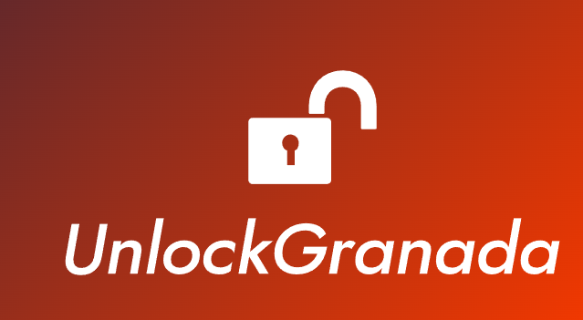

# DIU - Practica 3, entregables
En esta práctica vamos a diseñar prototipos para nuestra página web. Empezaremos diseñando un Moodboard.
## Moodboard (diseño visual + logotipo)   
Para el [Moodboard](./Moodboard.pdf), hemos desarrollado varios logotipos, que mostraremos en el Guideline, elegido la tipografía "Anton Regular" y una paleta de colores para nuestra web. 

## Landing Page
Partiendo de los [Bocetos](../P2/Bocetos.pdf) realizados en la práctica anterior, y con los logos y tipografía elegidos en el Moodboard.
Hemos desarrollado el Landing Page utilizando [Webflow](http://www.webflow.com/), una página que está basada en versiones antiguas de Material Design y que aporta muchas herramientas adecuadas para el diseño de la Landing Page y sigue su guía de estilo. 
Aquí dejamos el enlace para ver nuestra Landing Page [UnlockGranada](https://unlockgranada.webflow.io/).
Y una pequeña muestra de como queda.

## Guidelines
En esta seccion explicaremos el proceso y selección de los distinto elementos gráficos de la página web.

  ## LOGOTIPOS
  LOGO 1
  
  
  
  LOGO 2 
  
     
  
  LOGO 3
  
  
  
Durante el proceso de diseño del logo, hemos tenido varias ideas de logos, pero finalmente hemos optado por el último. Un diseño simple y limpio, fácil de reconocer y adaptable a distintos tamaños. También pensamos que puede ser representativo de Granada.
  
   ## Paleta de Colores
   
   
Los colores que más hemos usado son el Rojo Oscuro(#8D021F), el blanco y el negro. El color rojo aporta energía y es muy llamativo para destacar botones y sitios importantes de la página. El blanco, aporta pureza, la claridad y la simplicidad, es un color muy limpio, que usado para el fondo hace que el texto e imágenes destaquen más. Por último, el negro que es un color más elegante que se puede usar también para crear contraste.

   ## Tipografía
   
Hemos elegido la fuente "Anton Regular", una fuente sans-serif de aspecto moderno que se puede utilizar en todos los aspectos de la página web. Tiene un diseño minimalista que dada su forma puede dar un aspecto sencillo y limpio a la página web. También, es una tipografía legible en varios tamaños lo que aporta flexibilidad para ser la fuente principal de la página.

## Iconos
Los iconos los hemos sacado de [FontAwesome](fontawesome.com). Aquí dejamos los iconos que hemos usado y su significado:

  - Arrow-left: lo hemos usado para avanzar imágenes hacia la izquierda
  - Arrow-right: para avanzar imágenes hacia la derecha
  - Clock: Indica la duración de los tours
  - Fire: Los tours más populares
  - Star/Star-half-stroke: indica la puntuación de los tours
  - Weelchair-move: Para indicar los tours adaptados para personas con movilidad reducida
  - Circle-check: Indica que el pago se ha realizado con éxito.
  
## Mockup: LAYOUT HI-FI

Para realizar los prototipos, hemos usado Figma, además de usar grid layout para su diseño. Hemos creado una simulación de un proceso de reserva de un tour desde que inicias sesión hasta que pagas. También hemos creado un prototipo de otra propuesta de valor añadido que pensamos, que era conectar a la ciudad con el equipo de fútbol y también una app que permitiese seguir rutas sin la necesidad de un guía.
 

 

Todos los bocetos están en: 

Y también tenemos un vídeo en el que se muestra el proceso de reserva y de pago de un tour en:

## Valoración del equipo sobre la realización de esta práctica o los problemas surgidos
Ha sido una práctica extensa, pero bastante entretenida, ya que teníamos que crear como una marca propia, con su logotipo, sus colores, su fuente ... Además hemos aprendido a usar Figma de forma más profunda, ya que hemos tenido que llevar a cabo el diseño de los bocetos HIFI. En definitiva, a pesar de su dificultad y extensión, nos ha parecido una práctica muy útil y entretenida.

 
