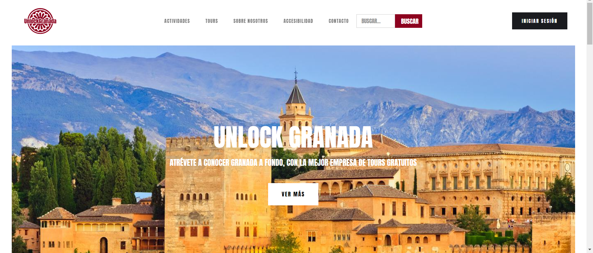

# DIU - Practica 3, entregables
En esta práctica vamos a diseñar prototipos para nuestra página web. Empezaremos diseñando un Moodboard.
## Moodboard (diseño visual + logotipo)   
Para el [Moodboard](./Moodboard.pdf), hemos desarrollado varios logotipos, que mostraremos en el Guideline, elegido la tipografía "Anton Regular" y una paleta de colores para nuestra web. 

## Landing Page
Partiendo de los [Bocetos](../P2/Bocetos.pdf) realizados en la práctica anterior, y con los logos y tipografía elegidos en el Moodboard.
Hemos desarrollado el Landing Page utilizando [Webflow](http://www.webflow.com/), una página que está basada en versiones antiguas de Material Design y que aporta muchas herramientas adecuadas para el diseño de la Landing Page. 
Aquí dejamos el enlace para ver nuestra Landing Page [UnlockGranada](https://unlockgranada.webflow.io/).
Y una pequeña muestra de como queda.

## Guidelines
En esta seccion explicaremos el proceso y selección de los distinto elementos gráficos de la página web.

  ## LOGOTIPOS
  LOGO 1
  
  
  
  LOGO 2 
  
     
  
  LOGO 3
  
  
  
Durante el proceso de diseño del logo, hemos tenido varias ideas de logos, pero finalmente hemos optado por el último. Un diseño simple y limpio, fácil de reconocer y adaptable a distintos tamaños. También pensamos que puede ser representativo de Granada.
  
   ## Paleta de Colores
   
   
Los colores que más hemos usado son el Rojo Oscuro(#8D021F), el blanco y el negro. El color rojo aporta energía y es muy llamativo para destacar botones y sitios importantes de la página. El blanco, aporta pureza, la claridad y la simplicidad, es un color muy limpio, que usado para el fondo hace que el texto e imágenes destaquen más. Por último, el negro que es un color más elegante que se puede usar también para crear contraste.

   ## Tipografía
   
Hemos elegido la fuente "Anton Regular", una fuente sans-serif de aspecto moderno que se puede utilizar en todos los aspectos de la página web. Tiene un diseño minimalista que dada su forma puede dar un aspecto sencillo y limpio a la página web. También, es una tipografía legible en varios tamaños lo que aporta flexibilidad para ser la fuente principal de la página.
  
## Mockup: LAYOUT HI-FI

## Documentación: Publicación del Case Study

(incluye) Valoración del equipo sobre la realización de esta práctica o los problemas surgidos
 
