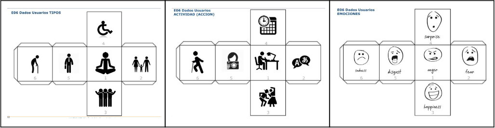
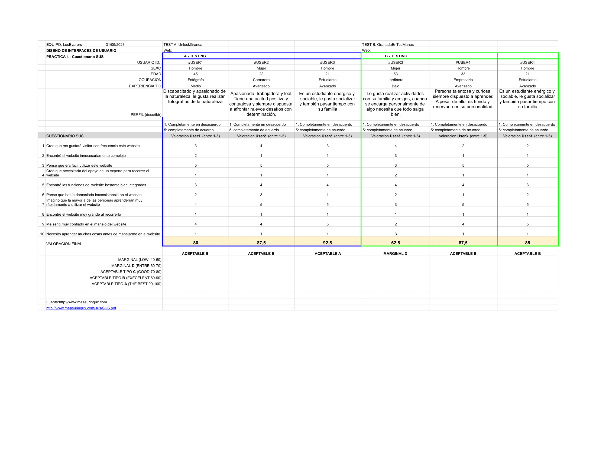

# DIU - Practica 4, entregables

* Fernando Pastrana Gómez
* Iván Gijón Cañete

Elección y características

* A/B Testing. 
Hemos realizdao el A/B testing del caso asignado. El caso A somos nosotros, y el caso B es el que nos han asignado, [GrandaEnTusManos](https://github.com/DIU3-GatosUniversitarios/DIU/blob/master/README.md).
Una vez asignado el caso, para la realización del cuestionario SUS, hemos hecho uso de la técnica Roleplaying. Hemos creado 4 personas fictias(2 para cada caso)
y además una persona real que ha realizado la encuesta.

# ROLEPLAYING

Con los resultados de los dados y las personas creadas, han quedado finalmente así:
  - Pesona 1 Jorge: Tipo: 4 (Discapacidad motriz) Acción: 5 (Realizar fotos) Emoción: 4 (Sorprendido) Jorge es un hombre de 45 años, con una discapacidad motriz que le impide caminar. Desde siempre le ha gustado mucho la fotografía y el arte y trabaja como fotógrafo para los álbumes de comuniones. Al acceder a la página web, le sorprendió que hubiera tours adaptados para personas con discapacidades y visibles a simple vista, con todas las facilidades explicadas.
  - Persona 2 Athenea: Tipo: 5 (Trabajador) Acción:3 (Actividades culturales) Emoción:3 (Felicidad) Athenea es una mujer de 28 años, que vive en Albacete y es camarera. Es muy fan del Granada CF y quiere aprovechar sus vacaciones, para además de visitar la ciudad, realizar el tour del estadio Nuevo Los Cármenes y poder ver un partido del Granada, por lo tanto está feliz.
  - Persona 3 Sofía: Tipo: 3 (Grupo de amigos) Acción: 4 (Planificar ruta o itinerario) Emoción: 6 (Triste) Sofía es una mujer de 53 años, y por vacaciones unos amigos de la infancia vienen a Granada a visitarla. Sofía está pensando en realizar un taller de cerámica y lo hace a través de la aplicación móvil. Sin embargo, Sofía tiene un uso de internet bajo y no está familiarizada con las aplicaciones móvil. A pesar de su entusiasmo, Sofía se siente un poco insegura al hacer una reserva por el móvil. Esto le genera cierta frustración y tristeza ya que quiere brindarles a sus amigos la mejor experiencia posible.
  - Persona 4 Brandon: Tipo: 2 (Familia) Acción: 2 (Extranjeros) Emoción: 2 (Miedo) Brandon va a visitar Granada junto a su esposa. Brandon es inglés, tiene 33 años, es dueño de una discoteca y le encanta la artesanía en general y por lo tanto quiere descubrir la artesanía local junto a su esposa. Sin embargo, teme que no haya demasiada información o talleres que les permitan descubrir la artesanía local, ni socializar con otras personas.
 
 # CUESTIONARIO SUS
 Una vez respondidas las preguntas del Cuestionario SUS por nuestros usuarios, estos han sidos los resultados:
 
 Para sacar las valoraciones hemos hecho uso de la siguiente tabla:
 
 Si se quiere ver con mayor detalle dejamos el enlace [aqui](./CuestionarioSUSDIU.xlsx)
 
  El caso A(nuestra página web) sale una nota media de 86 puntos que equivale a una web "Excellent" y para el caso B una media de 78 puntos, una web "Good" muy cerca de "Excellent". Aunque las muestras son escasas, significa que los usuarios han tenido una experiencia positiva con la página web y altamente usable. En el caso B, la valoración es un poco peor ya que para un usuario la búsqueda se complica un poco por las características del usuario. Si la muestra de usuarios fuera mayor, probablemente no sería tan notorio la opinión de usuario en concreto a la hora de puntuar.

  # USABILITY-REPORT
  El Usability-Report es una herramienta importante para evaluar y mejorar la experiencia del usuario en un producto o sistema que proporciona información detallada de los aspectos que se han     evaludado, para indicar las fortalezas y debilidades de la página, priorizar mejoras, etc.
  Aquí dejamos el enlace del [Usablity-Report](./UsabilityReport.pdf)
  
  
* Conclusiones
En conclusión, el uso de personas reales con perfiles diversos y una muestra amplia es fundamental para obtener resultados más precisos y significativos en el A/B testing y la evaluación del SUS score. Aunque el uso de dados y personajes ficticios puede ser una alternativa, se debe tener en cuenta que los casos extremos pueden tener un impacto significativo en los resultados finales. Por lo tanto, se recomienda priorizar la participación de usuarios reales para obtener una comprensión más completa de la usabilidad y evitar sesgos en la evaluación.
