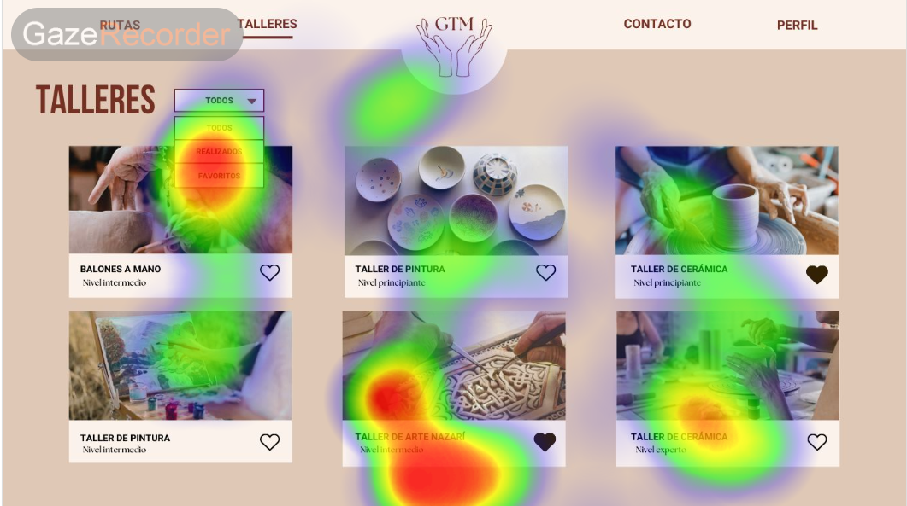
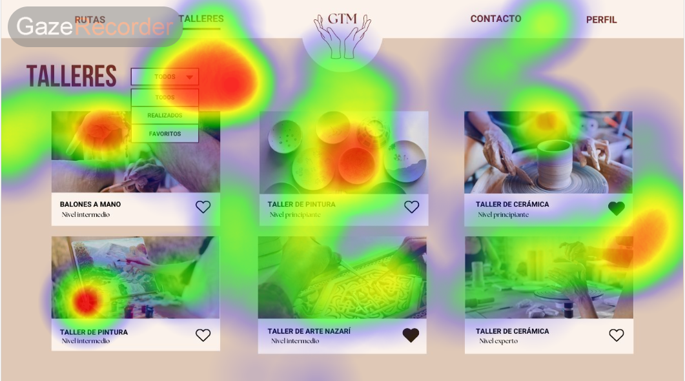
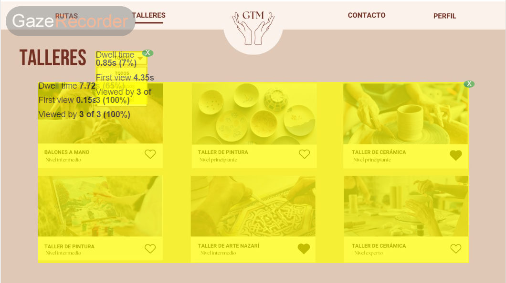

## Practica 5: entregables 

### Diseño del experimento
Para llevar a cabo nuestro experimento, empleamos la aplicación 'Gaze Recorder', un software diseñado específicamente para registrar y analizar los movimientos oculares de los participantes. Utilizando esta herramienta, capturamos datos precisos sobre la dirección de la mirada de los individuos mientras interactuaban con imágenes de la página web.
Después de obtener los registros oculares mediante la aplicación, procedimos a cargar las imágenes de la página web en el software para poder visualizar y analizar dónde las personas fijaron su mirada dentro de la página. Esto nos permitió identificar las áreas de mayor interés, así como también los patrones de atención y fijación de los participantes.
En nuestro experimento, los participantes que lo realizaron incluían expertos sobre el campo de estudio(nosotros), y dos personas sin experiencia específica en el tema. 
Antes de comenzar la prueba, se les dieron instrucciones claras a los participantes: debían centrar su mirada en las áreas que les parecieran más llamativas dentro de la página web y realizar varias acciones visuales, como consultar información, leer reseñas y reservar talleres, según su interés.

Aquí abajo se muestran varias imágenes de los resultados:

### Conclusión
Una vez analizados los datos, hemos llegado a una conclusión positiva. Los resultados revelan patrones consistentes y significativos en los movimientos oculares de los participantes al interactuar con la página web. 
El diseño visual de la página web ha sido exitoso en dirigir la mirada de los participantes hacia las áreas específicas que se deseaba resaltar utilizando elementos visuales impactantes, como imágenes atractivas y letras llamativas.
Estos hallazgos respaldan la importancia de un diseño visual estratégico y resaltan la efectividad de utilizar elementos visuales cautivadores para guiar la atención de los usuarios y comunicar información clave de manera impactante.
