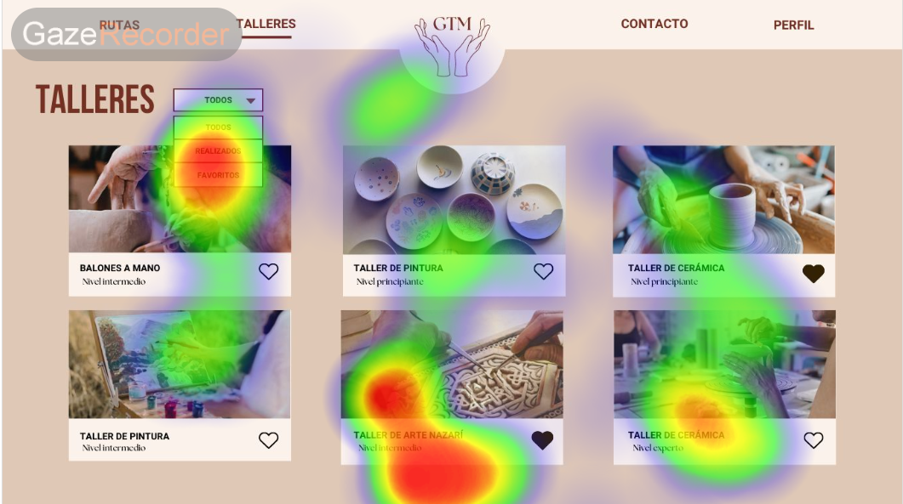
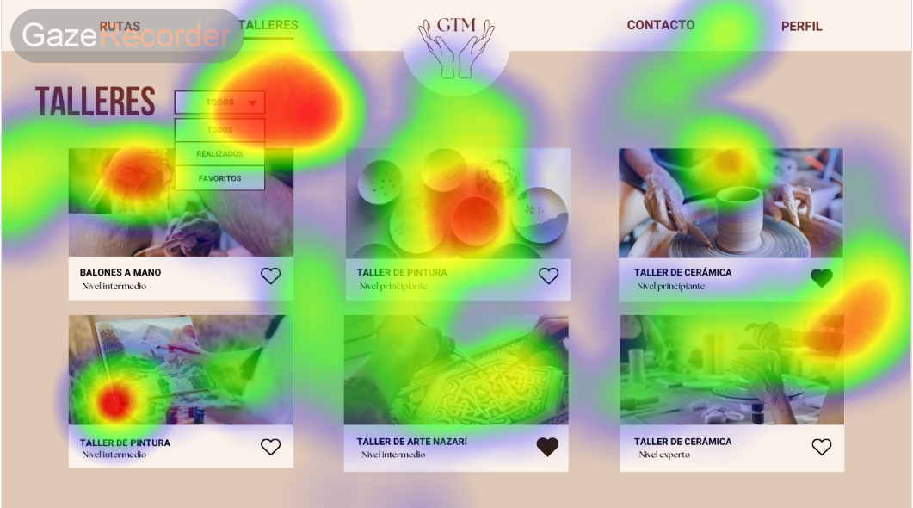

# DIU23
Prácticas Diseño Interfaces de Usuario 2022-23 (Tema: .... ) 

Grupo: DIU2_LosEvarers  Curso: 2022/23 
Updated: 11/1/2023

Proyecto: 
 UnlockGranada

Descripción: 

UnlockGranada es una página web que se dedica a ofrecer tours gratuitos por la ciudad de Granada. La página está diseñada para todos aquellos que quieran conocer la ciudad de una manera diferente, y se adaptan tanto a turistas extranjeros como a nacionales.
Además de los tours gratuitos, la web cuenta con una amplia sección de actividades que incluye opciones como tapas, flamenco y fútbol. De esta manera, los usuarios pueden disfrutar de la auténtica cultura granadina.
Si bien los tours son gratuitos, se permite una opción de pago para aquellos que quieran ir más allá en el conocimiento de la ciudad y sus secretos. Además, los tours privados también son una opción que se presenta en la plataforma.
En conclusión, UnlockGranada es una página web que ofrece una experiencia turística completa en la ciudad de Granada, con la posibilidad de conocer la cultura local de una manera más auténtica y perspicaz.

Logotipo: 

Miembros
 * Fernando Pastrana Gómez   [@ferni011](https://github.com/ferni011)
 * Iván Gijón Cañete [@ivaninigc](https://github.com/ivaninigc)

----- 

# Proceso de Diseño 

## Paso 1. UX Desk Research & Analisis 

 1.a Competitive Analysis
-----

[Competitive Analysis](P1/COMPETITIVE-ANALYSIS.pdf) Después de un análisis competitivo de las empresas de tours en Granada, podemos concluir que Free-Tour Granada es una buena opción para los clientes que buscan una experiencia de tour gratuita con varias funcionalidades útiles. Su sitio web es responsive y fácil de navegar en dispositivos móviles, y también ofrecen un calendario en línea que permite a los clientes ver qué plazas están disponibles en un tour en una hora determinada. Además, proporcionan información detallada sobre la ruta del tour en su sitio web, lo que es muy útil para los clientes que buscan una experiencia de tour más informada.
Aunque no ofrecen tours privados personalizados como lo hace Walkin Granada, Free-Tour Granada es una buena opción para los clientes que buscan una experiencia de tour gratuita y no necesitan servicios adicionales como tours personalizados o una fuerte presencia en redes sociales.
En cuanto a las redes sociales, Free-Tour Granada no tiene ni Twitter ni Facebook como la competencia, por lo que no puede promocionarse tanto. En general, Free-Tour Granada ofrece una opción de tour gratuita con varias funcionalidades útiles, lo que puede ser una buena opción para los clientes que buscan una experiencia de tour más económica y no necesitan servicios adicionales.

 1.b Persona
-----

 Hemos seleccionado a [Pedrinho](P1/Pedrinho.pdf) porque es una persona a la que le encanta el arte, y quiere conocer los rincones más bonitos de Granada por lo que querrá usar la web.

 También hemos seleccionado a [Teresa](P1/Teresa.pdf) , una española que trabaja en Alemania y que tiene un marido con problemas de movilidad debido a un accidente de tráfico.

 1.c User Journey Map
----

 [Visita de Pedrinho y su hermano](P1/Pedrinho-UserJourney.pdf) Aquí se muestra el viaje de Pedrinho a Granada para conocer la Alhambra y demás ya que le encanta el arte. Este User Journey, muestra el caso de una persona que quiere visitar Granada, pero mediante tours gratuitos, finalmente no reserva nada ya que 
no se indican apropiadamente la disponibilidad de los tours y la información de cada uno.

 [Problema para personas con movilidad reducida en tours](P1/Teresa-UserJourney.pdf) Teresa quiere que su marido conozca Granada, de dónde es ella pero se da cuenta que no hay ningún tour en la web para personas con problemas de movilidad. En este caso, a Teresa no le importa pagar por tours pero necesita un tour
adaptado a personas con movilidad reducida por su marido. La información de los tours no es clara y no disponen de tours adaptados, por tanto, tampoco reserva
ninguno.

 1.d Usability Review
----
 - Enlace al documento:  [Usability Review](P1/Usability-review-template-FreeTourGranada.pdf)
 - Valoración final (numérica): 77
 - Comentario sobre la valoración:  En general, el sitio web de tours gratuitos en Granada cumple con las expectativas de los usuarios al proporcionar una amplia variedad de contenido, una navegación intuitiva y un diseño claro y organizado. Sin embargo, hay algunas áreas en las que se puede mejorar, como proporcionar atajos para usuarios que usen mucho el sitio, como podría ser crearles un usuario con el que no tengan que rellenar sus datos cada vez que quieran realizar una reserva. Además, es necesario agregar un mapa del sitio o un índice para facilitar la navegación. En general, el sitio es fácil de usar y navegar, pero hay algunas mejoras que podrían hacerse para mejorar la experiencia del usuario.

## Paso 2. UX Design  

 2.a Feedback Capture Grid
----

El Feedback Capture Grid es una herramienta para recopilar y categorizar comentarios y opiniones. Con secciones como "Interesante/Relevante", "Críticas Constructivas", "Preguntas" e "Ideas", ayuda a organizar el feedback recibido. Esto permite identificar puntos de interés, áreas de mejora, dudas y propuestas creativas. El Grid facilita la toma de decisiones y la mejora continua al analizar y actuar sobre la retroalimentación de manera estructurada.

  
 En nuestra Propuesta de Valor, nos hemos querido centrar en mejorar las adaptabilidades de los tours para personas 
 con algún tipo de discapacidad, creando tours con buses y facilidades para éstos e indicándolo claramente.
 También, aprovechar la localización final de los tours para recomendar bares/restaurantes cercanos para la gente
 que acabe de realizar, dando ofertas y recomendaciones. Por último, no sólo centrarnos en tours culturales, realizar
 también actividades relaciondas con el club de fútbol de Granada.

 2.b ScopeCanvas
----

El análisis de un Scope Canvas implica desglosar y comprender los elementos clave de un proyecto o iniciativa. Consiste en identificar y definir claramente los objetivos, necesidades, propósito, requisitos,acciones y métricas asociadas con el proyecto. Este análisis ayuda a tener una visión clara y completa de lo que se pretende lograr, los límites y las condiciones en las que se llevará a cabo el proyecto.

 2.b Tasks analysis 
-----

El análisis de tareas de una página web implica descomponer y comprender las acciones y procesos que los usuarios realizan al interactuar con el sitio. Se trata de identificar las actividades específicas que los usuarios llevan a cabo, los pasos involucrados y los posibles desafíos que puedan enfrentar durante su navegación.

En este apartado se ordenan por prioridad de utilización las tareas que se pueden realizar en nuestra página web.
Los grupos que consideramos más importantes son:
  - Usuarios Nacionales.
  - Residentes de Granada.
  - Extranjeros: los extranjeros pueden tener una experiencia negativa al usar la página web si no se les tiene
    en cuenta como posibles clientes, y hablando de turismo son un conjunto muy importante.
  - Guías: Pueden información más específica sobre los tours
  - Administrador: Encargado en realizar las modificaciones en la página web.

 2.c IA: Sitemap + Labelling 
----
El SiteMap muestra la estructura organizada de todas las páginas de nuestro sitio web.
Como vemos en el sSitemap, los apartados con más importancia son el apartado de tours y actividades

Este labelling es útil para entender la organización del sitio web y facilitar la navegación del usuario

 2.d Wireframes
-----
Finalmente, estos son los bocetos Lo-Fi que hemos desarrollado. Hemos desarrollado Bocetos de las páginas que hemos considerado más importantes. 
## Pagina Principal

## Tours

## Inicio Sesión

 

## Paso 3. Mi UX-Case Study (diseño)

 3.a Moodboard
-----

Para el Moodboard hemos utilizado la herramienta [milanote](https://milanote.com/), ya que tiene una interfaz muy intuitiva, fácil
de utilizar y sencilla. También permite combinar imágenes, texto, enlaces y otros recursos visuales en un solo lugar.
El logotipo lo hemos realizado desde la pagina web https://logo.com/. Facilita mucho este proceso ya que tiene una amplia sección
de plantillas para logos y es muy sencillo la personalización de éstos. Gracias a esto, ha sido un proceso rápido y sencillo de 
realizar.

  3.b Landing Page
----
El landing page lo hemos realizado desde [WebFlow](https://webflow.com/). Una página que facilita mucho el proceso de creacción del 
prototipo, aquí el enlace para ver el landing page completo [UnlockGranda](https://unlockgranada.webflow.io/) y una pequeña imagen del mismo.
 

 3.c Guidelines
----
Durante el logotipado, iniciamos con este diseño simple 

Luego de descubrir la página logo.com hicimos estos dos diseños:

Finalmente nos decantamos por el último logo, un logo simple, sofisticado y minimalista.
Este logo no serviría como imagen de twitter pero la web que hemos usado permitía modificar el logo
para su uso como foto de perfil, por tanto, si fuera necesario no sería un problema.

## Paleta de Colores
La paleta de colores que hemos usado es la siguiente:
 

 
Nos hemos decantado por colores simples y tonos de rojo que te pueden recordar a Granada por la fruta,
el equipo de fútbol o la Alhambra en sus tonos mas anaranjados.

## Iconos
Los iconos los hemos sacado de [FontAwesome](fontawesome.com). Aquí dejamos los iconos que hemos usado y su significado:

  - Arrow-left: lo hemos usado para avanzar imágenes hacia la izquierda
  - Arrow-right: para avanzar imágenes hacia la derecha
  - Clock: Indica la duración de los tours
  - Fire: Los tours más populares
  - Star/Star-half-stroke: indica la puntuación de los tours
  - Weelchair-move: Para indicar los tours adaptados para personas con movilidad reducida
  - Circle-check: Indica que el pago se ha realizado con éxito.

 ## Tipografía
 Hemos considerado que una única fuente es suficiente, la que hemos elegido ha sido "Anton Regular", una fuente sans-serif 
 de aspecto moderno que se puede utilizar en todos los aspectos de la página web  y se adapta bien a todos los tamaños.
  
 
  
  3.d Mockup
----

Los prototipos los hemos realizado en Figma, para verlos, están en este [enlace](https://www.figma.com/file/qvujjh1yU9roAkiWlUwRco/HI-FI-BOCETOS-Y-SIMULACION?type=design&node-id=0%3A1&t=IU25BqT6PJuR50JG-1) y aquí dejamos varios de ellos.

 3.e ¿My UX-Case Study?
-----

Aquí dejamos un pequeño vídeo de como podría ser la navegación por nuestra página web para la reserva y pago de un tour.
[Video](https://youtu.be/cZfsBs03Uf4)

## Paso 4. Evaluación 

 4.a Caso asignado
----

Se nos ha asignado analizar la web de DIU3.GatosUniversitarios, que trata de la artesanía nazarí y de rutas turísticas por la ciudad de Granada.
El enlace al repositorio es:
[Repositorio](https://github.com/DIU3-GatosUniversitarios/DIU/tree/master)

 4.b User Testing
----
Para realizar el proceso de User Testing, se han seleccionado inicialmente 4 personas. A la hora de definir sus características, emociones y comportamientos se ha utilizado el método role playing. Los usuarios que hemos seleccionado son:
Primera Persona Jorge: 
Tipo: 4 (Discapacidad motriz)
Acción: 5 (Realizar fotos)
Emoción: 4 (Sorprendido)
Jorge es un hombre de 45 años, con una discapacidad motriz que le impide caminar. Desde siempre le ha gustado mucho la fotografía y el arte y trabaja como fotógrafo para los álbumes de comuniones. Al acceder a la página web, le sorprendió que hubiera tours adaptados para personas con discapacidades y visibles a simple vista, con todas las facilidades explicadas.

Segunda Persona Athenea:
Tipo: 5 (Trabajador)
Acción:3 (Actividades culturales)
Emoción:3 (Felicidad)
Athenea es una mujer de 28 años, que vive en Albacete y es camarera. Es muy fan del Granada CF y  quiere aprovechar sus vacaciones, para además de visitar la ciudad, realizar el tour del estadio Nuevo Los Cármenes y poder ver un partido del Granada, por lo tanto está feliz.

Tercera Persona Sofía: 
Tipo: 3 (Grupo de amigos)
Acción: 4 (Planificar ruta o itinerario)
Emoción: 6 (Triste)
Sofía es una mujer de 53 años, y por vacaciones unos amigos de la infancia vienen a Granada a visitarla. Sofía está pensando en realizar un taller de cerámica y lo hace a través de la aplicación móvil. Sin embargo, Sofía tiene un uso de internet bajo y no está familiarizada con las aplicaciones móvil. A pesar de su entusiasmo, Sofía se siente un poco insegura al hacer una reserva por el móvil. Esto le genera cierta frustración y tristeza ya que quiere brindarles a sus amigos la mejor experiencia posible.

Cuarta Persona Brandon:
Tipo: 2 (Familia)
Acción: 2 (Extranjeros)
Emoción: 2 (Miedo)
Brandon va a visitar Granada junto a su esposa. Brandon es inglés, tiene 33 años, es dueño de una discoteca y le encanta la artesanía en general y por lo tanto quiere descubrir la artesanía local junto a su esposa. Sin embargo, teme que no haya demasiada información o talleres que les permitan descubrir la artesanía local, ni socializar con otras personas.

| Usuarios | Sexo/Edad     | Ocupación   |  Exp.TIC    | Personalidad | Plataforma | TestA/B
| ------------- | -------- | ----------- | ----------- | -----------  | ---------- | ----
| Jorge         | H / 45   | Fotógrafo   | Media       | Formal       | Windows    | A 
| Athenea       | M / 28   | Camarera    | Alta        | Extrovertida | Móvil      | A 
| Sofía         | M / 53   | Jardinera   | Baja        | Introvertida | Móvil      | B 
| Brandon       | H / 33   | Empresario  | Alta        | Tímido       | MAC        | B 

. 4.c Cuestionario SUS
----

Para evaluar la satisfacción de los usuarios con el diseño y realizar el A/B testing, utilizaremos el cuestionario SUS, que consta de 10 preguntas. Cada pregunta se valora en una escala del 1 al 5 para evaluar el grado de satisfacción y usabilidad de la página web. Una vez recopilados los cuestionarios de los usuarios, utilizaremos una hoja de cálculo proporcionada para calcular una puntuación numérica basada en el cuestionario SUS.

Luego de calcular la puntuación numérica del cuestionario SUS, podemos utilizarla para obtener una medida cuantitativa de la satisfacción y usabilidad de la página web. Esta puntuación nos permitirá comparar diferentes diseños o variantes y determinar cuál tiene un mayor impacto positivo en la experiencia del usuario.

Un valor numérico muchas veces puede ser poco representativo y difícil de entender, por eso haremos uso de esta SUS Score, para darle un valor lingüístico a los números.
 

 Fuente:https://www.torresburriel.com/weblog/2018/09/26/cinco-formas-de-interpretar-un-sus/

Para el caso A sale una puntuación media de 86 puntos, que equivale a una web "Excellent" y para el caso B una puntuación media de 78 puntos, una web "Good" muy cerca de "Excellent". Aunque las muestras son escasas, significa que los usuarios han tenido una experiencia positiva con la página web y altamente usable. En el caso B, la valoración es un poco peor ya que para un usuario la búsqueda se complica un poco por las características del usuario. Si la muestra de usuarios fuera mayor, probablemente no sería tan notorio la opinión de usuario en concreto a la hora de puntuar.
También indicar que cuestionario SUS y la puntuación numérica nos brindarán una perspectiva inicial de la satisfacción de los usuarios. Sin embargo, para obtener una comprensión más completa y contextualizada de la experiencia del usuario, también debemos considerar otros factores cualitativos, como los comentarios y las observaciones de los usuarios durante el proceso de prueba.

 4.d Usability Report
----

A partir de la información recopilada previamente, se ha preparado un informe de usabilidad para el caso B. Para acceder al informe completo, puedes hacer clic en el siguiente [enlace](./P4/UsabilityReport.pdf). El objetivo del informe de usabilidad ha sido proporcionar una visión objetiva y basada en evidencia sobre la calidad y la eficacia del diseño del caso B, así como ofrecer orientación para realizar ajustes y mejoras que optimicen la experiencia del usuario.

# Paso 5. Eye Tracking

   
5.a Diseño del experimento y reclutado de usuarios

Diseño del experimento:
En este experimento hemos utilizado Gaze Recorder.Hemos subido los diseños de la web de Granada En Tus Manos, y tras esto hemos definido un tiempo de 12 segundos para cada imagen, el experimento consiste en ver en que es en lo que se fijan los usuarios cuando ven los distintos apartados de la web.Hemos definido distintos áreas de interés de cada parte de la web, para ver si el usuario mira a lo que creemos que debe de mirar. Son tareas de exploración.

Reclutado de usuarios:
Para el reclutado de usuarios hemos pasado el siguiente enlace: [Experimento](https://app.gazerecorder.com/Study/Test?StudyID=7e7cc679474008d84c082940626f6d0b&lang=es&RespondentID=null)

Una vez realizada la prueba por los usuarios podemos ver los puntos que más le llaman la atención a los usuarios.

5.b Informe y conclusiones

Hemos usado un usuario experto(nosotros) y también dos usuarios distintos que no sabían donde debían de mirar y los resultados son los siguientes:

Podemos ver que el experto se fija en el botón de Editar perfil y de cancelar reserva mientras que los usuarios no.

Podemos ver que no hay diferencias significativas

Podemos ver que no hay diferencias significativas

Podemos ver que no hay diferencias significativas

Podemos ver que no hay diferencias significativas

Por lo tanto como conlusión podemos observar que la web está bien diseñada, ya que los elementos que queremos que mire el usuario para realizar rutas,talleres,iniciar sesión etc. , son los elementos que primero miraría una persona que entra a la web por primera vez.

